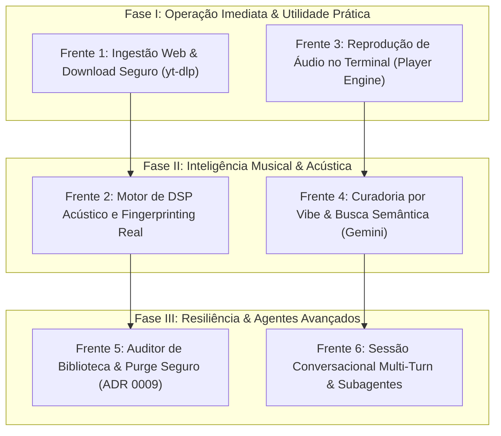

# Roadmap de Evolução Funcional: Próximas Funcionalidades Reais

> **Projeto**: MusicMatch  
> **Data de Formalização**: Setembro de 2026  
> **Status**: Proposto / Aprovado para Planejamento  
> **Referência Arquitetural**: Conecta os ADRs 0001 a 0009 e os estudos de engenharia do `docs/`  

---

## 1. Visão Geral e Contexto de Evolução

O **MusicMatch** consolidou sua base técnica na versão `0.2.0`:
- **Clean Architecture & DDD**: Separação estrita entre Apresentação (`ConsoleUI`), Comandos (`CommandRegistry`), Serviços de Aplicação (`LibraryService`), Domínio (`Track`, `ScanResult` em Pydantic V2) e Persistência (`SQLiteTrackRepository` com SQLite FTS5).
- **Varredura Idempotente & Stat-Cache ([ADR 0009](file:///c:/WebApps/musicmatch/docs/adr/0009-library-idempotency-stat-cache-and-lifecycle-policy.md))**: Chave canônica SHA-256 (`trk_<hash>`), validação instantânea em $O(1)$ por `mtime` e tamanho em bytes, e política de ciclo de vida não-destrutiva (`AVAILABLE` vs `MISSING`).
- **Suíte de Testes Automatizados**: 87 testes unitários e de integração cobrindo fluxos felizes e de exceção com 100% de sucesso.

Com os alicerces de dados, persistência e harness validados, este documento estabelece as **6 frentes de funcionalidades reais** para transformar o MusicMatch em um gerenciador e reprodutor de música de ponta, nativo de Inteligência Artificial.

---

## 2. Mapa Estratégico das Frentes Funcionais

---

## 3. Detalhamento Técnico das 6 Frentes

---

### Frente 1: Ingestão Web e Download Seguro com `yt-dlp`

#### Objetivo
Permitir que o usuário e o Agente Inteligente incorporem novas músicas diretamente de plataformas web (YouTube, SoundCloud, Bandcamp) para a biblioteca local do computador, com catalogação instantânea no banco de dados.

#### Fundamentação Técnica
Conforme os relatórios [`docs/YT-DLP_RELATORIO_TECNICO.md`](file:///c:/WebApps/musicmatch/docs/YT-DLP_RELATORIO_TECNICO.md), [`docs/YT-DLP_RELATORIO_TECNICO_E_SEGURANCA.md`](file:///c:/WebApps/musicmatch/docs/YT-DLP_RELATORIO_TECNICO_E_SEGURANCA.md), o [ADR 0010 - Estratégia de Integração do yt-dlp](file:///c:/WebApps/musicmatch/docs/adr/0010-yt-dlp-integration-and-packaging-strategy.md), o [ADR 0011 - Web Ingestion Pipeline, Two-Stage Staging Architecture, and Managed Library Taxonomy](file:///c:/WebApps/musicmatch/docs/adr/0011-web-ingestion-two-stage-staging-and-managed-library-taxonomy.md) e o [ADR 0012 - Governança e Resolução da Managed Library](file:///c:/WebApps/musicmatch/docs/adr/0012-managed-library-governance-resolution-and-safeguards.md), a arquitetura de ingestão web opera sob o modelo de dois estágios e taxonomia canônica:
1. **Blindagem contra SSRF e Recursos**: Bloqueio de `enable_file_urls: False`, filtro `match_filter` para barrar transmissões ao vivo infinitas (`!is_live`) e limite de duração máxima (ex: 30 minutos).
2. **Proteção contra Path Traversal**: Uso estrito de `prepare_filename` ou IDs canônicos para evitar nomes maliciosos oriundos de títulos da web.
3. **Pós-processamento de Áudio**: Conversão transparente via `FFmpegExtractAudio` para MP3/FLAC em diretório dedicado (`data/downloads` ou pasta configurada no `.env`).
4. **Isolamento de Código e CI/CD**: Código do `yt-dlp` desacoplado da `src/`, com desenvolvimento local conectado ao clone `C:\WebApps\yt-dlp` via `pip install -e` e resolução automatizada no GitHub Actions.
5. **Preservação de Áudio Nativo**: Extração do melhor stream sem perdas de transcodificação (`.m4a`/`.opus`), com conversão opcional para MP3 320 kbps sob demanda (`--format mp3`).
6. **Isolamento de Staging & Taxonomia Canônica**: Ingestão particionada por sessões com manifestos `session.json`, promoção não-destrutiva e estrutura física em `Artists/<Artist>/<Album>`, `Various Artists/<Album>` e `Collections/<Name>`.
7. **Governança Multiplataforma da Biblioteca**: Resolução canônica em `~/Music/MusicMatch/` (Windows, macOS, Linux), verificação atômica de escrita (`.musicmatch_probe`) e bloqueio de caminhos críticos do SO.

#### Componentes a Criar / Modificar
* **`musicmatch.services.downloader` (`AudioDownloaderService`)**:
  - Encapsula chamadas ao `YoutubeDL` executadas fora da thread principal do REPL via `asyncio.to_thread` / `run_in_executor`.
  - Emite eventos de progresso de download (percentual, velocidade, ETA) para a interface.
* **Ferramenta do Agente (`musicmatch.tools.downloader`)**:
  - `download_track(url: str, target_genre: Optional[str] = None) -> dict`: Inspeciona os metadados online, confirma a validade e efetua a ingestão.
* **Comandos CLI**:
  - `/download <url>`: Inicia o download direto no terminal com barra de progresso textual.
  - `/inspect-url <url>`: Consulta metadados remotos sem baixar o arquivo (`skip_download=True`).
* **Integração com `LibraryService`**:
  - Ao finalizar o download e a conversão de tags, dispara o `AudioScanner` pontualmente sobre o arquivo baixado, inserindo-o de imediato no `tracks` e `tracks_fts`.

---

### Frente 2: Motor de DSP Acústico e Fingerprinting Real

#### Objetivo
Substituir as métricas provisórias de áudio por cálculos analíticos reais do sinal de áudio, capacitando o sistema para deduplicação acústica e recomendações baseadas em física sonora.

#### Fundamentação Técnica
Atualmente, o `bpm` depende de tags ID3 manuais (ou padrão `120.0`) e o `lufs` (loudness) permanece `None`. A análise acústica real eleva a qualidade do catálogo:
1. **Acoustic Fingerprinting (Chromaprint / AcoustID)**:
   - Extração do vetor de fingerprint a partir do bitstream decodificado via `pyacoustid` / `fpcalc`.
   - Permite associar faixas que possuem nomes de arquivos ou tags diferentes, mas a mesma gravação sonora.
2. **Medição de Loudness Integrado (EBU R128 / LUFS)**:
   - Medição do volume percebido segundo a norma internacional EBU R128 (janelas momentânea, curta e integrada).
   - Base fundamental para normalização de ganho (*ReplayGain*) sem clipping digital.
3. **Detecção Acústica de BPM e Grade de Batidas**:
   - Algoritmo de detecção de transientes de energia e correlação rítmica para encontrar o andamento exato da faixa.
4. **Análise Harmônica e Tonalidade Musical (*Camelot Wheel*)**:
   - Identificação da nota tônica e modo (ex: 8A / A-minor, 11B / A-major) para viabilizar mixagens e transições harmônicas.
5. **Cache de Mini-Waveforms**:
   - Geração de vetores condensados de picos (RMS/Peak) salvos em formato binário ou JSON leve no banco de dados para renderização visual instantânea.

#### Componentes a Criar / Modificar
* **`musicmatch.services.dsp` (`AudioDSPService`)**:
  - Pipeline de cálculo de LUFS, BPM e Fingerprint.
  - Preparado para integração posterior com a biblioteca compilada em Rust (`musicmatch_core` via PyO3).
* **Migração de Banco de Dados**:
  - Adição de colunas estruturadas na tabela `tracks`: `fingerprint TEXT`, `musical_key TEXT`, `waveform_peaks BLOB/TEXT`.

---

### Frente 3: Reprodução de Áudio Integrada no Terminal (Player Engine)

#### Objetivo
Permitir que o usuário reproduza faixas diretamente pela interface do MusicMatch, com controle de transporte, fila de reprodução e indicação visual de progresso.

#### Fundamentação Técnica
A aplicação gerencia bibliotecas locais de áudio, mas ainda depende de reprodutores externos. O player embutido fecha o ciclo completo de experiência do usuário:
1. **Engine de Áudio Leve e Concorrente**:
   - Decodificação e envio de PCM para o driver de áudio do sistema operacional sem bloquear o loop de comandos do terminal.
   - Opções de backend tecnológico: `miniaudio`, `pygame.mixer` ou `sounddevice`.
2. **Controle de Estado de Reprodução**:
   - Estados: `STOPPED`, `PLAYING`, `PAUSED`.
   - Monitoramento contínuo da posição atual (`current_time_seconds`) versus duração total.

#### Componentes a Criar / Modificar
* **`musicmatch.services.player` (`AudioPlayerService`)**:
  - Singleton de controle de reprodução de áudio, volume, play, pause, resume, seek e fila (*play queue*).
* **Apresentação em `ConsoleUI`**:
  - Mini-player no rodapé do terminal ou sob demanda: `[▶ Reproduzindo] Queen - Bohemian Rhapsody [02:14 / 05:55] [██████░░░░]`.
* **Comandos CLI**:
  - `/play <id | termo de busca>`: Localiza a faixa via FTS5 e inicia o áudio imediatamente.
  - `/pause`: Pausa o áudio.
  - `/resume`: Retoma a reprodução.
  - `/stop`: Para a reprodução e reseta o ponteiro.
  - `/volume <0-100>`: Ajusta o volume de saída.
  - `/queue`: Exibe e gerencia as próximas músicas da fila.
* **Ferramenta para o Agente**:
  - `play_track(query_or_id: str)`: Permite que comandos em linguagem natural (ex: *"Toque uma música calma de jazz"*) iniciem a reprodução diretamente.

---

### Frente 4: Curadoria por "Vibe" & Busca Semântica com Google Gemini

#### Objetivo
Transformar o MusicMatch em um curador musical inteligente que compreende nuances acústicas, momentos do dia, sentimentos e contextos de escuta.

#### Fundamentação Técnica
Aproveitar os modelos multimodais da família Gemini (`gemini-3.6-flash` / `gemini-3.1-pro`) e suas capacidades de raciocínio profundo:
1. **Classificação e Enriquecimento Semântico em Lote**:
   - Rotina em background para analisar os metadados existentes e preencher o campo `mood` de faixas que estão em branco (ex: *"energético, ritmo constante para corrida, sintetizadores retrô"*).
2. **Busca por Vibe em Linguagem Natural**:
   - O usuário solicita: *"Músicas animadas dos anos 80 com mais de 120 BPM para programar"* ou *"Faixas melancólicas com violão acústico parecidas com Radiohead"*.
   - O Agente analisa a requisição, traduz para parâmetros relacionais + termos do índice FTS5 e seleciona a sequência ideal.
3. **Geração de Playlists Inteligentes com Critério Harmônico**:
   - Combinação das variáveis de DSP (BPM próximo e compatibilidade de tom na *Camelot Wheel*) com a compatibilidade de humor (*mood*), gerando transições suaves de playlist.

#### Componentes a Criar / Modificar
* **`musicmatch.services.curator` (`CuratorService`)**:
  - Lógica de síntese de playlists, ordenação harmônica e enriquecimento em lote com Gemini.
* **Ferramentas do Agente**:
  - `create_smart_playlist(theme_or_vibe: str, target_duration_minutes: int) -> dict`.
* **Comandos CLI**:
  - `/vibe <descrição da vibe>`: Atalho para curadoria rápida por linguagem natural.
  - `/enrich-mood [limit]`: Dispara o enriquecimento de humor para faixas ainda não categorizadas.

---

### Frente 5: Auditor de Biblioteca & Purge Seguro (ADR 0009)

#### Objetivo
Completar as especificações do [ADR 0009](file:///c:/WebApps/musicmatch/docs/adr/0009-library-idempotency-stat-cache-and-lifecycle-policy.md) que tratam da integridade física de grandes coleções e expurgo auditado de arquivos ausentes.

#### Fundamentação Técnica
Conforme definido no ADR 0009:
1. **Expurgo em Duas Etapas com Confirmação Rígida**:
   - Músicas ausentes no disco passam para o estado `MISSING` e nunca são excluídas sozinhas pelo scanner.
   - O expurgo físico do catálogo requer intervenção deliberada do usuário, protegida por frase de segurança.
2. **Heurística de Reconciliação Rápida de Arquivos Movidos**:
   - Se o usuário renomear uma pasta ou mover arquivos no Windows Explorer, o próximo escaneamento identifica correspondência exata por `file_size`, duração e título, migrando o registro antigo para o novo caminho sem perder métricas pré-calculadas.
3. **Auditoria de Integridade**:
   - Diagnóstico de arquivos com bitrate muito baixo, metadados nulos ou corrupção de tags.

#### Componentes a Criar / Modificar
* **Comando `/prune`**:
  - Protocolo de confirmação: exige que o usuário digite a chave exata `PLEASEPRETTYPLEASE` para remover definitivamente faixas com `status = 'MISSING'`.
* **Comando `/audit`**:
  - Exibe um painel analítico com:
    - Total de faixas `AVAILABLE` vs `MISSING`.
    - Faixas sem artista ou título definido.
    - Faixas potencialmente duplicadas (mesmo título/artista ou mesmo hash acústico).
    - Faixas com tags corrompidas encontradas em varreduras anteriores.
* **Método de Reconciliação no `SQLiteTrackRepository`**:
  - `reconcile_relocated_tracks()` para restaurar status e atualizar caminhos de forma segura.

---

### Frente 6: Sessão Conversacional Multi-Turn no REPL

#### Objetivo
Evoluir o agente de turno único ([ADR 0003](file:///c:/WebApps/musicmatch/docs/adr/0003-didactic-incremental-evolution.md)) para um assistente conversacional contínuo com histórico de contexto e suporte à orquestração de subagentes.

#### Fundamentação Técnica
1. **Histórico Conversacional Dinâmico**:
   - Manutenção de contexto ao longo da sessão interativa através da API de chats (`client.chats.create` no SDK `google-genai`).
   - Permite diálogos encadeados como:
     - *Usuário*: "Busque faixas de Rock clássico."
     - *Agente*: "Encontrei 5 faixas: Queen, Led Zeppelin..."
     - *Usuário*: "Toque a segunda." (o agente infere que se trata de Led Zeppelin).
2. **Subagentes Especializados**:
   - Preparar o ecossistema para subagentes autônomos conforme o padrão do Google Antigravity SDK:
     - `LibrarianAgent`: Responsável pela organização de pastas, downloads e reconciliação.
     - `CuratorAgent`: Especialista em harmonia, humor e montagem de sets musicais.
     - `AuditorAgent`: Diagnóstico de integridade e reparos em background.

#### Componentes a Criar / Modificar
* **`musicmatch.agent.session` (`MultiTurnAgentSession`)**:
  - Gerencia o histórico de turnos, memória de curto prazo e ciclo ReAct integrado.
* **Adaptação do `Harness`**:
  - Encaminha o fluxo conversacional contínuo para a sessão ativa do agente.

---

## 4. Matriz de Priorização e Cronograma Recomendado

| Ordem | Frente Funcional | Impacto no Usuário | Complexidade | Dependências Principais |
| :---: | :--- | :---: | :---: | :--- |
| **1** | **Frente 1: Ingestão Web (`yt-dlp`)** | 🟢 Alto | 🟡 Média | `yt-dlp`, `ffmpeg` |
| **2** | **Frente 3: Reprodução de Áudio (Player)** | 🟢 Alto | 🟡 Média | `miniaudio` / backend de som |
| **3** | **Frente 5: Auditor & Purge (ADR 0009)** | 🟡 Médio | 🟢 Baixa | SQLite / Schema existente |
| **4** | **Frente 4: Curadoria por Vibe & IA** | 🟢 Alto | 🟡 Média | `google-genai` / Gemini API |
| **5** | **Frente 2: Motor DSP & Fingerprint** | 🟢 Alto | 🔴 Alta | `pyacoustid`, bibliotecas de áudio |
| **6** | **Frente 6: Sessão Multi-Turn & Subagentes** | 🟡 Médio | 🟡 Média | `google-genai` chats / SDK |

---

## 5. Diretrizes de Qualidade para Execução

1. **Test-Driven Development (TDD)**: Toda nova ferramenta, comando ou serviço deve nascer acompanhado de testes unitários com mocks adequados (sem chamadas reais de rede ou dependência de caixas de som nos testes do CI).
2. **Isolamento de Segurança**: Seguir estritamente as regras de blindagem contra SSRF, DoS e injeção de parâmetros documentadas para o `yt-dlp`.
3. **Compatibilidade Multiplataforma**: Garantir que caminhos de arquivos e decodificadores de áudio funcionem perfeitamente no ambiente Windows/NTFS nativo.
4. **Convenções Linguísticas**:
   - Código-fonte, commits, variáveis e docstrings em **Inglês**.
   - Toda documentação de engenharia em `docs/` e diálogos com o usuário em **Português (Brasil)**.

