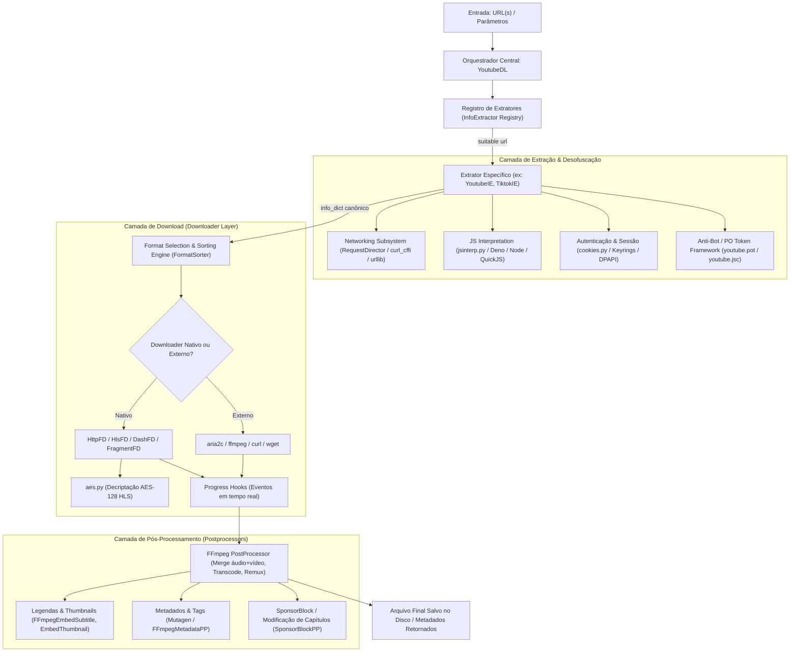

# Relatório Técnico de Engenharia de Software: Análise Profunda da Base de Código `yt-dlp`

---

## 1. Visão Geral e Propósito do Projeto

O **`yt-dlp`** é a ferramenta e biblioteca em Python mais avançada e amplamente utilizada no mundo para extração de metadados, streaming e download de áudio e vídeo da web. Ele nasceu como um fork ativo do lendário `youtube-dl`, com o objetivo de solucionar problemas críticos que acometeram o projeto original: desaceleração das taxas de download devido a travas do YouTube, descontinuação temporária de manutenção, vulnerabilidade a proteções anti-bot e falta de suporte a novos protocolos de streaming modernos.

Hoje, o `yt-dlp` evoluiu para um ecossistema de engenharia autônomo com mais de **1.700 extratores especializados** cobrindo não apenas o YouTube, mas centenas de plataformas como:
- **Redes Sociais & Vídeos Curtos**: TikTok, Instagram, Twitter/X, Bluesky, Facebook, Reddit.
- **Transmissões ao Vivo & Jogos**: Twitch, Kick, Bilibili, Niconico, Huya, Douyu.
- **Plataformas de Música & Podcasts**: SoundCloud, Bandcamp, Apple Podcasts, Spotify (metadados), Mixcloud, Jamendo.
- **Portais de Mídia e VOD**: Vimeo, Dailymotion, Rumble, plataformas educacionais (Udemy, Teachable, Coursera, MIT), portais governamentais e de notícias.

O código opera em dois modos fundamentais:
1. **Ferramenta de Linha de Comando (CLI)**: Executável independente ou pacote acionado via terminal com centenas de parâmetros de configuração.
2. **Biblioteca / SDK Python (Core Engine)**: Classes puras que podem ser instanciadas e integradas diretamente em backends (FastAPI, Django, Celery, scripts de automação ou pipelines de Inteligência Artificial).

---

## 2. Arquitetura do Sistema e Fluxo de Execução

A arquitetura do `yt-dlp` é baseada em um pipeline em camadas altamente desacoplado, modular e extensível:



### 2.1. O Ciclo de Vida de uma Operação (`YoutubeDL.py`)
Toda a orquestração reside na classe [`YoutubeDL`](file:///c:/WebApps/yt-dlp/yt-dlp/yt_dlp/YoutubeDL.py#L204):
1. **Inicialização**: A classe recebe um dicionário `params` (`ydl_opts`). Carrega cookies se configurado, inicializa o diretor de rede (`RequestDirector`), monta a cadeia de manipuladores e registra os extratores (via lazy loading em `lazy_extractors.py` para inicialização instantânea).
2. **Resolução de URL (`extract_info`)**: Itera sobre os extratores registrados. O método `ie.suitable(url)` avalia a regex de correspondência `_VALID_URL`.
3. **Extração de Metadados (`ie.extract(url)`)**: O extrator executa chamadas de API ou scraping HTTP. Retorna um dicionário canônico denominado `info_dict`.
4. **Resolução Recursiva (`process_ie_result`)**: Se o resultado for uma playlist (`_type == 'playlist'`), os itens são avaliados de forma preguiçosa (`LazyList`), permitindo streaming infinito ou paginação contínua sem consumir memória excessiva.
5. **Classificação e Seleção de Mídia (`process_video_result`)**: O seletor de formatos analisa todas as streams disponíveis (DASH, HLS, MP4 direto) e escolhe a combinação ideal de vídeo + áudio conforme a string de formato (ex: `bestvideo+bestaudio/best`).
6. **Download (`process_info`)**: Despacha o stream para o `FileDownloader` correspondente (`HttpFD`, `HlsFD`, `DashFD`, ou executáveis externos como `aria2c`).
7. **Pós-processamento (`postprocess`)**: Aciona a esteira de `PostProcessor`, chamando `ffmpeg` para unir as faixas, embutir legendas, ajustar capas e gravar metadados ID3/MP4 via `mutagen`.

---

## 3. Principais Módulos e Subcomponentes Internos

### 3.1. Subconjunto de Rede Moderno (`yt_dlp.networking`)
Diferente do antigo `youtube-dl` que se apoiava exclusivamente no `urllib` da biblioteca padrão, o `yt-dlp` possui um subsistema de rede de última geração:
- **`RequestDirector` & `RequestHandler`**: Roteamento dinâmico de requisições HTTP com base em capacidades.
- **Suporte a `curl_cffi` e Impersonação TLS**: Permite forçar fingerprints TLS (JA3/JA4, HTTP/2 frames, cipher suites) simulando navegadores reais (Chrome, Safari, Firefox, Edge). Isso contorna defesas WAF agressivas da Cloudflare, Akamai e Datadome sem necessidade de automação de navegador com Selenium/Playwright.
- **Transmissão WebSocket**: Suporte nativo a protocolos WebSocket (ex: downloads de lives do Niconico e chat do YouTube).

### 3.2. Extração e Decodificação de Cookies (`yt_dlp.cookies`)
Capacidade de extrair cookies autenticados diretamente dos perfis de navegadores instalados na máquina do usuário sem exigir login manual:
- Suporta: **Chrome, Edge, Brave, Opera, Vivaldi, Firefox, Safari**.
- Implementa a decriptação nativa de senhas e master keys:
  - **Windows**: DPAPI (`CryptUnprotectData`) + AES-256-GCM (esquema `v10`/`v20` do Chromium).
  - **macOS**: Keychain via comando `security`.
  - **Linux**: Secret Service API / D-Bus / GNOME Keyring / KWallet via `secretstorage` ou `jeepney`.

### 3.3. Interpretador JavaScript AST Puro (`yt_dlp.jsinterp`)
Plataformas como o YouTube alteram dinamicamente seus parâmetros de download (ex: deofuscação de assinaturas `s` e cálculo do parâmetro de throttling `n`).
- Em vez de depender obrigatoriamente do Node.js, o `yt-dlp` possui um **interpretador JavaScript completo escrito em Python puro** (`jsinterp.py`).
- Ele tokeniza e interpreta expressões JS, chamadas de funções, manipulação de protótipos de arrays (`slice`, `splice`, `reverse`) e aritmética bitwise de 32 bits, descriptografando o algoritmo diretamente em memória.
- Além do interpretador nativo, suporta motores externos como Deno, Bun, Node e QuickJS via [`_jsruntime.py`](file:///c:/WebApps/yt-dlp/yt-dlp/yt_dlp/utils/_jsruntime.py).

### 3.4. Criptografia Resiliente (`yt_dlp.aes`)
Streams HLS (`m3u8`) frequentemente vêm fragmentados em pedaços `.ts` ou `.m4s` cifrados com **AES-128-CBC**.
- O módulo [`aes.py`](file:///c:/WebApps/yt-dlp/yt-dlp/yt_dlp/aes.py) fornece decriptação de alta performance se `pycryptodomex` estiver instalado.
- Se nenhuma biblioteca C externa estiver presente, ele executa uma **implementação nativa de AES em Python puro** (com expansão de chave e tabelas S-Box implementadas matematicamente), garantindo que o programa nunca quebre por ausência de dependências compiladas.

### 3.5. Anti-Bot e PO Token Framework (`yt_dlp.extractor.youtube.pot` & `jsc`)
Em 2024–2026, o YouTube introduziu o **PO Token (Proof-of-Origin Token)**, integrando desafios Botguard / Attestation (WebPO) para validar se as requisições partem de clientes autorizados.
- O `yt-dlp` desenhou uma arquitetura de provedores plugáveis:
  - **PO Token Providers (`pot`)**: Provedores que resolvem tokens de atestação para clientes Innertube (`WEB`, `ANDROID`, `TVHTML5`).
  - **JS Challenge Providers (`jsc`)**: Provedores para resolver desafios matemáticos complexos de players novos.

### 3.6. Utilitário de Traversal Declarativo (`yt_dlp.utils.traversal.traverse_obj`)
Uma das joias funcionais da base de código:
- Permite consultar e transformar árvores complexas de JSON/dicionários/listas de APIs com sintaxe concisa, tratando chaves ausentes, erros de índice, transformações de tipo, filtros de predicado e caminhos alternativos (fallback) em uma única linha.

---

## 4. Matriz de Dependências

Uma das decisões de engenharia mais impressionantes do `yt-dlp` é a sua filosofia: **Zero dependências externas obrigatórias**.

| Componente | Tipo | Papel no Sistema | Impacto da Ausência |
| :--- | :--- | :--- | :--- |
| **Python 3.10+** | **Obrigatório** | Runtime base do projeto | Não executa em versões inferiores a 3.10. |
| **FFmpeg & FFprobe** | **Binário Externo (Altamente Recomendado)** | Mesclagem de vídeo/áudio DASH, extração de áudio, remuxing, conversão de legendas | Impossibilita baixar qualidades 1080p/4K/8K quando vídeo e áudio são servidos separados pelo servidor. |
| **curl-cffi** | **Python (Opcional)** | Impersonação TLS de navegadores reais (evita bloqueios WAF) | O sistema cai para `urllib`/`requests`; certos sites protegidos por Cloudflare retornarão HTTP 403. |
| **pycryptodomex** | **Python (Opcional)** | Aceleração C de decriptação AES (HLS e cookies) | O `yt-dlp` usa o `aes.py` nativo em Python puro (mais lento em CPU para vídeos pesados). |
| **mutagen** | **Python (Opcional)** | Escrita de tags e capas em arquivos de áudio (MP3, FLAC, M4A) | Metadados ID3/MP4 ricos não são embutidos no áudio final. |
| **websockets** | **Python (Opcional)** | Comunicação bidirecional WebSocket | Downloads de streams ao vivo em websocket falharão. |
| **brotli / brotlicffi** | **Python (Opcional)** | Descompressão de requisições HTTP Brotli (`br`) | Servidores web que só aceitam Brotli podem falhar. |
| **certifi** | **Python (Opcional)** | Cadeia de certificados CA atualizada | Dependerá dos certificados do sistema operacional. |
| **secretstorage / jeepney** | **Python (Opcional)** | Acesso ao chaveiro no Linux (GNOME Keyring / KWallet) | Não consegue decodificar cookies de navegadores no Linux. |
| **Deno / Node / Bun** | **Binário Externo (Opcional)** | Execução de desafios JS complexos/pesados | Usa o `jsinterp.py` interno (suficiente na maioria dos casos). |
| **aria2c** | **Binário Externo (Opcional)** | Downloader multi-thread com conexões simultâneas | Usa os downloaders nativos com uma única conexão por fragmento. |

---

## 5. Possibilidades de Reutilização em Outros Projetos

Se você já possui outros projetos (sistemas web, robôs de automação, processamento de dados ou pipelines de inteligência artificial), o `yt-dlp` pode ser aproveitado de várias maneiras:

### Cenário A: Extração de Metadados em Tempo Real (Sem Baixar o Vídeo)
Ideal para enriquecimento de catálogos, verificação de links, contagem de views, obtenção de transcrições e legendas:
```python
from yt_dlp import YoutubeDL

ydl_opts = {
    'quiet': True,
    'skip_download': True,
    'extract_flat': False,
}

with YoutubeDL(ydl_opts) as ydl:
    info = ydl.extract_info("https://www.youtube.com/watch?v=dQw4w9WgXcQ", download=False)
    
    video_data = {
        'id': info.get('id'),
        'title': info.get('title'),
        'duration': info.get('duration'),
        'uploader': info.get('uploader'),
        'view_count': info.get('view_count'),
        'thumbnail': info.get('thumbnail'),
        'subtitles': list(info.get('subtitles', {}).keys()),
        'formats_count': len(info.get('formats', []))
    }
```

### Cenário B: Pipeline de Ingestão de Áudio para Modelos de IA (Whisper / Transcrição)
Baixar o áudio convertido diretamente para MP3/WAV para processamento imediato:
```python
ydl_opts = {
    'format': 'bestaudio/best',
    'outtmpl': '/caminho/temporario/%(id)s.%(ext)s',
    'postprocessors': [{
        'key': 'FFmpegExtractAudio',
        'preferredcodec': 'wav',
        'preferredquality': '192',
    }],
    'quiet': True,
}

with YoutubeDL(ydl_opts) as ydl:
    info = ydl.extract_info(url, download=True)
    audio_path = f"/caminho/temporario/{info['id']}.wav"
    # Encaminhar audio_path diretamente para Whisper / transcritor
```

### Cenário C: Acompanhamento de Progresso via Hooks para WebSockets / SSE
Para exibir barras de progresso em tempo real em um front-end (React, Vue ou Flutter):
```python
def progress_callback(d):
    if d['status'] == 'downloading':
        percent = d.get('_percent_str', '0%')
        speed = d.get('_speed_str', 'N/A')
        eta = d.get('_eta_str', 'N/A')
        # Enviar evento via WebSocket para o cliente web:
        # websocket_manager.broadcast({"percent": percent, "speed": speed, "eta": eta})
    elif d['status'] == 'finished':
        filename = d['filename']
        # Notificar término

ydl_opts = {
    'progress_hooks': [progress_callback],
    'outtmpl': 'downloads/%(title)s.%(ext)s',
}
```

### Cenário D: Reutilização Isolada de Módulos Específicos
Você não precisa necessariamente importar o `YoutubeDL` inteiro se precisar apenas de ferramentas utilitárias:
1. **`yt_dlp.cookies.extract_cookies_from_browser`**: Ler cookies de navegadores locais para autenticar scripts de automação ou scrapers em outros sites.
2. **`yt_dlp.utils.traversal.traverse_obj`**: Usar como motor de busca e filtragem profunda em JSONs complexos e respostas de APIs REST de qualquer sistema.
3. **`yt_dlp.aes`**: Decriptador AES CBC/GCM em Python puro sem necessidade de bibliotecas C.
4. **`yt_dlp.networking.impersonate`**: Camada de requisições com TLS fingerprinting.

---

## 6. Cuidados, Desafios e Boas Práticas de Engenharia

Ao incorporar o `yt-dlp` em ambientes corporativos ou de produção:

1. **Bloqueio de Thread (I/O Bound)**:
   - Os métodos `extract_info()` e os downloaders são síncronos e bloqueantes.
   - Em aplicações com **FastAPI, Tornado ou asyncio**, nunca os invoque diretamente na thread de evento. Use:
     ```python
     import asyncio
     loop = asyncio.get_running_loop()
     info = await loop.run_in_executor(None, lambda: ydl.extract_info(url, download=False))
     ```
   - Em arquiteturas de microsserviços, o download deve ser tratado como uma tarefa assíncrona desacoplada via filas (**Celery**, **RQ**, **RabbitMQ** ou **Redis**).

2. **Fragilidade do Scraping e Degradação Natural (Bitrot)**:
   - Plataformas de vídeo alteram seus seletores CSS, APIs internas e travas anti-bot quase semanalmente.
   - É mandatório ter um pipeline contínuo de atualização da dependência (`pip install -U yt-dlp`) e testes automatizados de fumaça (smoke tests) para validar se a extração continua íntegra.

3. **Bloqueio de IP de Datacenter**:
   - Provedores como AWS, GCP, Azure, DigitalOcean e Hetzner sofrem bloqueios severos ou desafios de robô por parte do YouTube e Cloudflare.
   - Para ambientes de servidor, é indispensável configurar proxies residenciais ou autenticação via arquivo de cookies exportado (`--cookies` / `'cookiefile'`).

4. **Aspectos Legais e Licenciamento**:
   - O código-fonte original do `yt-dlp` está sob **The Unlicense** (domínio público, livre para uso comercial, modificação e redistribuição sem royalties).
   - Componentes embutidos ou de terceiros possuem licenças específicas documentadas em `THIRD_PARTY_LICENSES.txt`.
   - Atenção ao direito autoral dos conteúdos baixados e aos Termos de Serviço (ToS) das plataformas acessadas.
